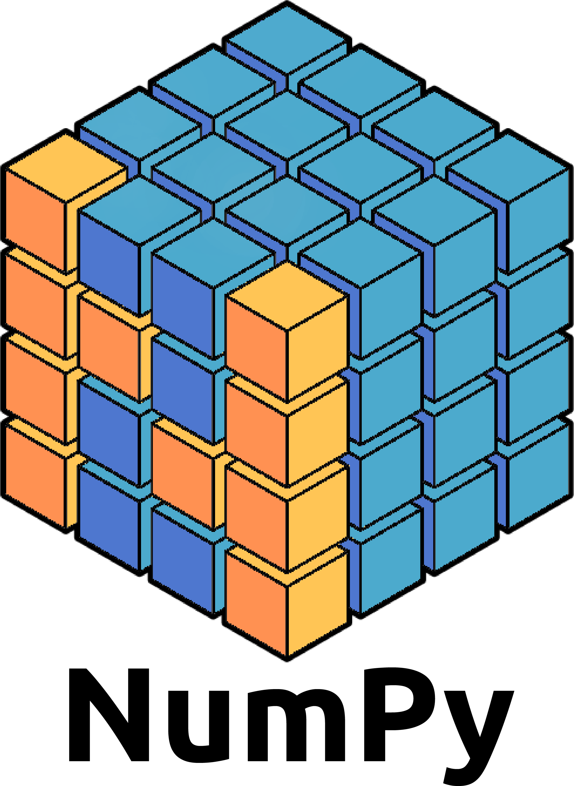

************************************************************************************************************
<!--🐍📈SNAKEGRAPH / 🌐WEBSITE: https://github.com/Platane/snk -->
<picture>
  <source media="(prefers-color-scheme: dark)" srcset="https://raw.githubusercontent.com/D3vil0p3r/D3vil0p3r/output/github-contribution-grid-snake-dark.svg" />
  <source media="(prefers-color-scheme: light)" srcset="https://raw.githubusercontent.com/D3vil0p3r/D3vil0p3r/output/github-contribution-grid-snake.svg" />
  
</picture>

************************************************************************************************************

 

 

  

  
  

  
  
  
  
  
  
  
  
  
 
  

  
  
  
  
  

  
  
  
  
  
  
  
  

 

 
 
 
 
 
 
 

 

*************************************************************************************

  

